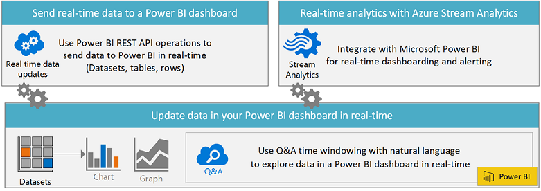

# Create a real-time Power BI dashboard
---
You can create a real-time Power BI dashboard using the Microsoft Power BI REST API or Microsoft Stream Analytics. Quickly add analytics to existing solutions for real-time data monitoring.

### Use Power BI REST API to send data to a Power BI dashboard in real-time
With the Power BI REST API, you can create your own business solution to push data into a Power BI dashboard in real-time.  Your dashboards will be updated in real-time when the data changes. You can use your choice of technology, including .NET, JQuery or Ruby, to write your app. The Power BI REST API uses industry standards such as OAuth2, and has REST operations to push data into a Power BI dashboard in real time. 

[Get started creating a Power BI app](https://powerbi.microsoft.com/en-us/documentation/powerbi-developer-steps-to-create-a-power-bi-app/)

-	Create datasets, and add and delete rows
-	Push data into Power BI in real-time from any app
-	Set a retention policy to automatically clean up old data
-	Discover metadata on existing datasets

### Use Azure Stream Analytics for real-time dashboarding and alerting into Power BI
Microsoft Azure Stream Analytics is a fully managed real-time stream computation service that provides low latency, scalable processing of streaming data in the cloud with an enterprise grade SLA. Integration with Microsoft Azure Event Hubs and Microsoft Power BI allows for real-time dashboarding and alerting alongside powerful visualizations over data pipelines. 

Learn more about [Azure Stream Analytics](http://azure.microsoft.com/services/stream-analytics).

-	Intake millions of events per second (up to 1 GB/s)
-	Low processing latency, auto adaptive (sub-second to seconds)
-	Correlate between different streams, or with reference data
-	Find patterns or lack of patterns in data in real-time

### Use natural language queries (Q&A) to find answers in your data
With Q&A, you can using time windowing with natural language to explore data in Power BI in real-time. Show dynamic time ranges with a UTC time column using Q&A such as:
-	heartrate for josh in the last 10 minutes
-	total visits by time in the last 90 minutes
-	total visits by local time where utc time is in the last 90 minutes

Learn more about [Q&A in Power BI](https://support.powerbi.com/knowledgebase/articles/474690).
