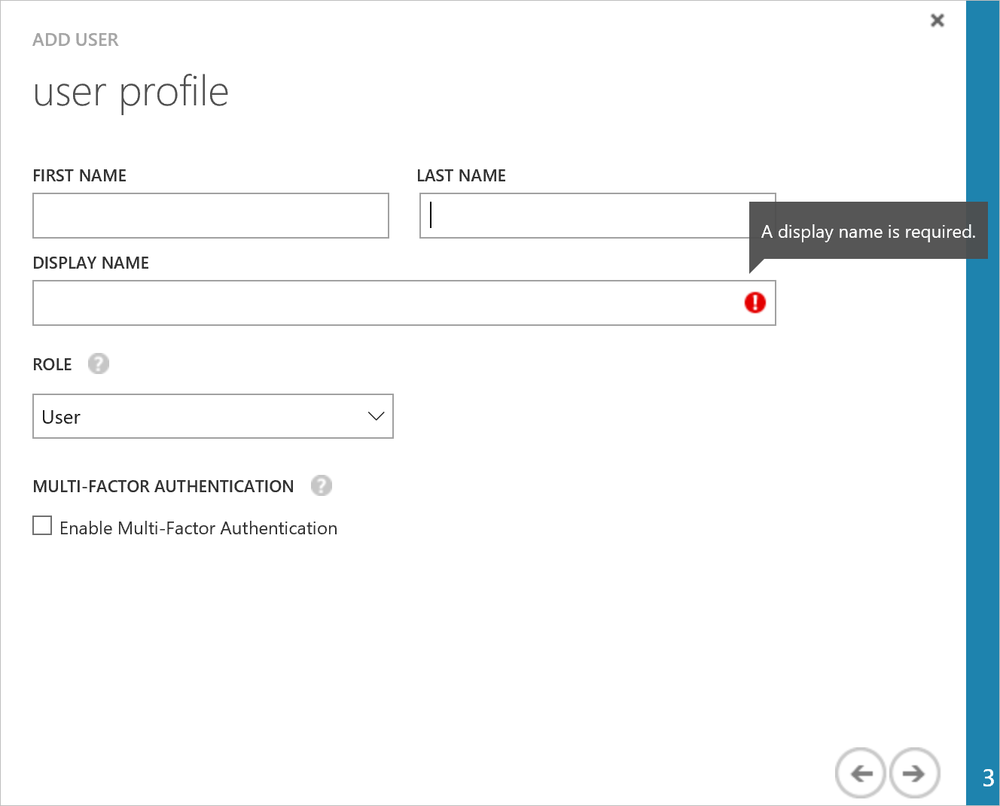

# Get started creating Power BI apps
Power BI displays dashboards that are interactive, and can be created and updated from many different data sources in real time. With the Microsoft Power BI REST API, you can programmatically access certain Power BI resources. Using the API, you can create an app in any platform that supports calling REST operations. 

You can **[try the Power BI REST API](http://docs.powerbi.apiary.io/#)** on Apiary without creating an app. To learn more about the Power BI REST API, see [Power BI REST API reference](Power-BI-REST-API-reference.md).

Before you get started creating a Power BI app, you need an **Azure Active Directory** and a **Power BI Service**. Here's what you will need to do before you start creating a Power BI app:

1. Have an **Azure Active Directory** with at least one organization user.
	- If you do not have an Azure Active Directory (AAD), see [Setup Azure Active Directory](#setup).
	- To create an organization user in an Azure AD tenant, see [Add a user to your Azure Active Directory](#newuser).
	 
2. Have a **Power BI Service**.  It's quick and easy to sign up for Power BI, go to [Sign up for Power BI](https://portal.office.com/Start?Sku=a403ebcc-fae0-4ca2-8c8c-7a907fd6c235/) to get started. 
	- **Note** You need an ADD organization user to sign up for Power BI.
3. Once you have a Power BI Service, you need to register your client app or web app. To learn how to register your Power BI app, see [Register a client app](Register-a-client-app.md) or [Register a web app](Register-a-web-app.md).

### Setup Azure Active Directory ###
Power BI apps are integrated with Azure Active Directory (AD) to provide secure sign in and authorization for your app. To integrate a Power BI app with Azure AD, you register the details about your application with Azure AD by using the Azure Management Portal.

#### To setup Azure Active Directory ####
 1. Navigate to https://manage.windowsazure.com and log in with the account that has an Azure subscription.
 2. Click **ACTIVE DIRECTORY** management icon in the left pane.
 3. Click **NEW** button at the bottom of the page.
 4. Choose **APP SERVICES** > **DIRECTORY** > **CUSTOM CREATE**.

    

 5. Enter a name and domain name. For country or region choose United States or the country were Power BI is available. 

    

 6. Choose OK icon. An Azure Active Directory is created.

#### Add a user to your Azure Active Directory ####
 1. In your Azure Active Directory, click **USERS**.

    

 2. At the bottom of the page, click **ADD USER**. A user account is used to sign up for Power BI.
 
     
 
	1. For **TYPE OF USER**, choose **New user in you organization**.
	2. Enter **USER NAME**.
	3. Enter {Azure_AD_name}.onmicrosoft.com. An Azure AD name is the same as a Tenant ID.
	4. Click **Next**.
	
	      
		   
	5. Enter a **user profile**
	6. click **Next**. For ROLE, you can use User. 
	7. Click **Create** to create a temporary. The new user is assigned a temporary password that must be changed on first sign in.
	8. In the Get temporary password page, click **Complete** icon. A new Azure AD user is created.

Once you have an **Azure Active Directory**, you need to sign up for Power BI.
 

### Sign up for Power BI ###

 1. [Sign up for Power BI](https://portal.office.com/Start?Sku=a403ebcc-fae0-4ca2-8c8c-7a907fd6c235/).
 2. In the Power BI registration page, enter the user that you created in the [Add a user to your Azure Active Directory](#newuser) steps. The format is {user name}@{Azure_AD_Name}.onmicrosoft.com.

The registration process validates the user and provisions the Power BI service in your Azure AD. After Power BI is provisioned, a Power Bi tenant is available for a user.

**Note**:  A first time Power BI registration can take up to 30 minutes to provision.

After you sign up for Power BI, you can register a Power BI app.

###Register your Power BI app
You can now register a Power BI app. To learn how to register an app, see [Register a client app](Register-a-client-app.md) or [Register a web app](Register-a-web-app.md).

After you register your app, you are ready to call the Power BI REST API operations. We have a couple of samples to help you get started writing an app.

###Power BI REST API samples
- [Client app authentication sample](Client-app-authentication-sample.md): Shows how to get an access token for a client app and execute all Power BI REST operations.
- [ASP.NET web app sample](Authenticate-a-web-app.md): Shows how to get an access token for a web app and execute a Power BI REST operation.
