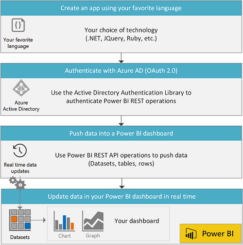

# Overview of Power BI REST API
---
	
Power BI displays dashboards that are interactive, and can be created and updated from many different data sources in real time. Just like a dashboard in your car displays important information about your vehicle, such as its speed, its fuel level, or how healthy the engine is, a dashboard in Power BI displays important information about your business.

### Create custom Power BI dashboards with real-time data push
Using any programming language that supports REST calls, you can create a business solution that updates a Power BI dashboard in real-time.

With the Power BI REST API, you can:
-	[Authenticate Power BI REST operations with Azure Active Directory OAuth2](https://powerbi.microsoft.com/en-us/documentation/powerbi-developer-authenticate-to-power-bi-service/)
-	[Create and get datasets](Dataset-operations.md)
-	[Set a retention policy to automatically clean up old data](Automatic-retention-policy-for-real-time-data.md)
-	[Get and update table schemas](Table-operations.md)
-	[Add and delete rows](Row-operations.md)
- [Get groups](Get-Groups.md)
- [Import PBIX or Excel files](Import-operations.md)
- [Get tiles](Get-Tiles.md)

Here's the overall flow for a Power BI app created using the REST API.

### Here’s some of the ways you can use the Power BI REST API

-	**Create real-time dashboards from your app** - 
	Uncover real-time insights from devices, sensors and applications. Use the 	**Power BI REST API** or [Azure Stream Analytics](http://azure.microsoft.com/services/stream-analytics/) to push data directly from your application into a dataset in Power BI.

-	**Check out the Power BI projects on GitHub and our samples** - GitHub has many Power BI projects: Go to [GitHub](https://github.com/search?utf8=%E2%9C%93&q=Power+BI) and search “Power BI”. Or, take a look at [our samples](http://go.microsoft.com/fwlink/?LinkId=618971). We have these samples:
	-	[Client app sample](Power-BI-client-app-sample.md): A console app that shows you how to authenticate a client app and call all Power BI operations.
	-	[Web app sample](Power-BI-web-app-sample.md): A web app that shows you how to authenticate a Power BI web app.

-	[**Try the Power BI REST API**](http://docs.powerbi.apiary.io/) -
In the Apiary interactive API console, you can try all Power BI REST API operations such as [Create Dataset](Create-Dataset.md) and [Get Datasets](Get-Datasets.md).

### To learn more about the Power BI REST API

-	[Get started creating a Power BI app](https://powerbi.microsoft.com/en-us/documentation/powerbi-developer-steps-to-create-a-power-bi-app/)
-	[Power BI REST API reference](Power-BI-REST-API-reference.md)
