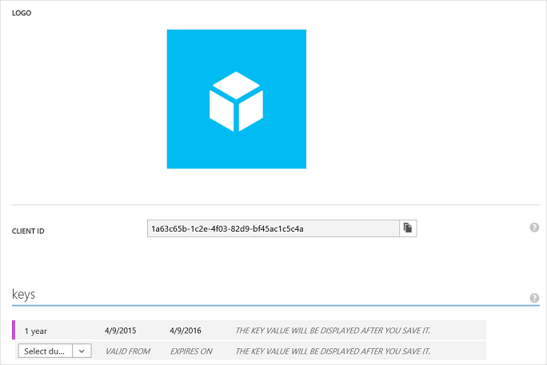
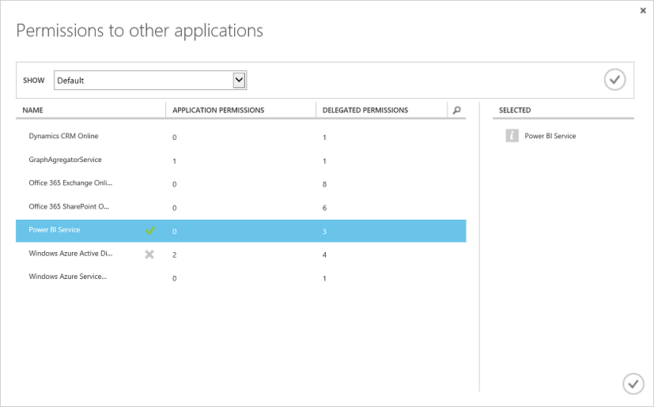

# Register a web app
---
This article shows you how to register a Power BI web app in Azure Active Directory (Azure AD). To allow your application access to the Power BI REST API, you need to register your application with **Azure Active Directory**. This will allow you to establish an identity for your application and specify permissions to Power BI REST resources. For a list of Power BI permissions, see [Power BI permissions](Power-BI-permissions.md).

**Important** Before you register a Power BI app you need an [Azure Active Directory and an organizational user](Create-an-Azure-Active-Directory-tenant.md), and a [Power BI service account](Sign-up-for-Power-BI-service.md). 

There are two ways to register your web app: with the Power BI App Registration Tool or on Azure Management Portal. The Power BI App Registration Tool is the easiest option since there are just a few fields to fill in. If you want to make changes to you app, this can be done through the Azure Management Portal.

### In this article

- [Register a web app with Power BI App Registration Tool](#webTool)
- [Register a web app with Azure Management Portal](#web)
- [How to get a client id ](#clientID)
- [How to get a client secret key](#clientSecret)

## Register a web app with Power BI App Registration Tool
You need to register your web app in **Azure Active Directory** to establish an identity for your application and specify permissions to Power BI REST resources. When you register a web app, you receive a **Client ID** and **Client Secret**.  The **Client ID** is used by the application to identify themselves to the users that they are requesting permissions from. The client secret **Key** is used by the web app to securely identify themselves to the **Power BI service**.

Here's how to register your web app with the **Power BI App Registration Tool**:

1.	Go to dev.powerbi.com/apps.
2.	In the Power BI App Registration Tool, follow these four steps.
**Step 1** - Choose **Login in** to login to your Azure AD account. You will see your name in the Welcome line.
**Step 2** – Enter information about your app:
    * **App Name**: The name of your app.
    * **App Type**: Choose Native app.
    * **Redirect URI**: For a web app, a redirect uri gives AAD more details on the specific application that it will authenticate. An example **Redirect URI** looks like this: http://localhost/redirect.
    * **Home Page**: The home page or sign on page for your web app.

    

**Step 3** – Choose APIs to access. For more information about Power BI access permissions, see [Power BI Permissions](Power-BI-permissions.md).
 

  
**Step 4** - To register your app, click **Register App**. After the app is registered in Azure AD, you will get a **Client ID** and **Client Secret** key. Make sure you copy the Client ID and Client Secret key. You can get the Client ID or Client Secret key later in the **Azure Management Portal**. See [How to get a client id in Azure Management Portal](#clientID) and [How to get a client secret key](#clientSecret).

You can now use your **Client ID** and **Client Secret** for your app. The next section shows how to register a web app with **Azure Management Portal**.

## Register a web app with Azure Management Portal
When you register a web app, you receive an **Client ID** and a client secret **Key**. The **Client ID** is used by the application to identify themselves to the users that they are requesting permissions from. The client secret **Key** is used by the web app to securely identify themselves to the **Power BI service**.

To learn how to authenticate a web app using an Azure AD **Client ID** and client secret **Key**, see [Authenticate a web app](Authenticate-a-web-app.md).

Here's how to register a client app:

1. Accept the [Microsoft Power BI API Terms](https://powerbi.microsoft.com/en-us/api-terms).
2. Sign into your Microsoft Azure subscription at https://manage.windowsazure.com.
3. In the left service panel, choose **ACTIVE DIRECTORY**.
4. Click any active directory.

    

5. Click **APPLICATIONS**.

    

6. Click **ADD**. 

    
7.	In **Tell us about your application**, enter a **NAME**, and choose **WEB APPLICATION AND/OR WEB API** for the type, and click **Next** icon.

    

8. In **App properties**, enter a **SIGN-ON URL** and **APP ID URI**. The **SIGN-ON URL** is your web app url such as https://localhost:44307. The **APP ID URI** is your Azure Tenant URI followed by your app name. For example, https://yourtenant.onmicrosoft.com/YourWebApp.

    

9.	Click the **Complete** icon.
10.	In the application page, choose **CONFIGURE**. The **CONFIGURE** page has a **Client ID** and **Key** for your app.

    

11. For a web app, you need a client secret **Key**. In the **keys** section, select a duration. The key is displayed after you **Save** it. Make sure you copy the key; otherwise, the key will not be available upon future navigation to the configuration page.

12.	In the **CONFIGURATION** page, click **Add Application**.
13. In **Permissions to other applications**, choose **Power BI Service**.

    

    **Important** If you do not see **Power BI Service** in the **Permissions to other applications** list, you need to sign up for the [Power BI Service](https://www.powerbi.com/). To sign up for the Power BI Service, you need at least one organizational user in your Azure Active Directory (AAD) tenant. If you do not have an Azure Active Directory (AAD) tenant, see [Setup Azure Active Directory](Setup-Azure-Active-Directory.md) to create an Azure AD tenant and an organizational user in your Azure AD tenant.
    
14. Click **Complete** icon which is located at the lower right corner of the page.
15. In the **permissions to other applications** group, choose all **Delegated Permissions**. For more information about Power BI permissions, see [Power BI Permissions](Power-BI-Permissions.md).

    

16. Click **Save**.

	** Important **
	For a web app, you need a client secret **Key**. The client secret **Key** is displayed after you **Save** it. Make sure you copy the key; otherwise, the key will not be available upon future navigation to the configuration page.

## How to get a client app id
When you register a web app, you receive a **Client ID**.  The **Client ID** is used by the application to identify themselves to the users that they are requesting permissions from.

Here's how to get a client app id:

1. Sign into your Microsoft Azure subscription at https://manage.windowsazure.com.
2. In the left service panel, choose **ACTIVE DIRECTORY**.
3. Choose any active directory.
4. Click **APPLICATIONS**.
5. Choose an application.
6. In the application page, choose **CONFIGURE**.
7. In the **CONFIGURE** page, copy the **CLIENT ID**.

    
  

## How to get a client secret

For a web app, you need a client secret **Key**. When you register a web app, Azure AD generates a key (see step 11 above). In the **keys** section, select a duration. The key is displayed after you save it. Make sure you copy the key; otherwise, the key will not be available upon future navigation to the configuration page.

## Next steps to create a Power BI app
- [Create your Power BI app](Introduction-to-creating-a-Power-BI-app.md)
- [Learn how to Authenticate with Azure AD](Authenticate-to-Power-BI-service.md)

