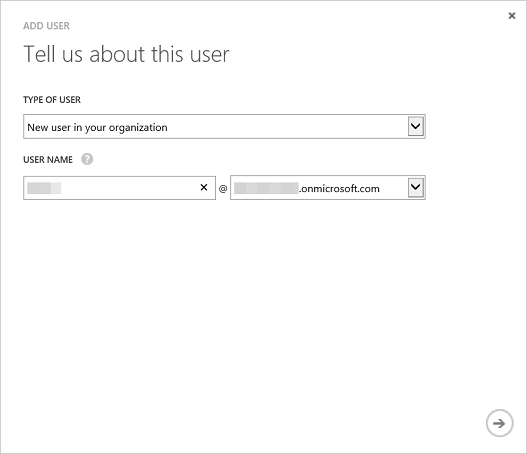

# Setup Azure Active Directory
---
Using the Power BI REST API, you can create a Power BI app in any platform that supports calling REST operations. However, before you get started creating a Power BI app, you need an **Azure Active Directory**, an organizational user, and a [Power BI service](Sign-up-for-Power-BI-service.md) account.

###In this article
- [Create an Azure Active Directory (AAD) tenant](#setup)
- [Add a user to your Azure Active Directory](#newuser)

##Create an Azure Active Directory tenant for a Power BI app

Power BI apps are integrated with **Azure Active Directory** (Azure AD) to provide secure sign in and authorization for your app. To integrate a Power BI app with Azure AD, you register the details about your application with Azure AD by using the Azure Management Portal.

**Important** To sign up for the **Power BI service**, your **Azure Active Directory** must have at least one organizational user. Use your organizational user to [sign up for the Power BI service](Sign-up-for-Power-BI-service.md).

### Setup Azure Active Directory (AAD)
Before you get started creating a Power BI app, you need **Azure Active Directory** and an organizational user. Here's how to setup **Azure Active Directory**:

 1. Navigate to https://manage.windowsazure.com and log in with the account that has an Azure subscription.
 2. Click **ACTIVE DIRECTORY** management icon in the left pane.
 3. Click **NEW** button at the bottom of the page.
 4. Choose **APP SERVICES** > **DIRECTORY** > **CUSTOM CREATE**.

    

 5. Enter a name and domain name. For country or region choose United States or the country were Power BI is available. 

    

 6. Choose OK icon. An Azure Active Directory is created.

### Add a user to your Azure Active Directory
You use the user from your Azure AD to sign up for the **Power BI service**. Once you login to the **Power BI service** for the first time, you’ll see the **Power BI service** added to your Azure AD which will allow you to create Power BI apps with the right permissions. Here's how to add a user your Azure Active Directory:

 1. In your Azure Active Directory, click **USERS**.

    

 2. At the bottom of the page, click **ADD USER**. A user account is used to sign up for Power BI.
 
     
 
	1. For **TYPE OF USER**, choose **New user in you organization**.
	2. Enter **USER NAME**.
	3. Enter {Azure_AD_name}.onmicrosoft.com. An Azure AD name is the same as a Tenant ID.
	4. Click **Next**.
	
	      
		   
	5. Enter a **user profile**
	6. click **Next**. For ROLE, you can use User. 
	7. Click **Create** to create a temporary. The new user is assigned a temporary password that must be changed on first sign in.
	8. In the Get temporary password page, click **Complete** icon. A new Azure AD user is created.

Once you have an **Azure Active Directory** and an organizational user, you need to sign up for Power BI. 

##Next step to create a Power BI app - Sign up for Power BI
- [Sign up for Power BI](Sign-up-for-Power-BI-service.md)

**Note** When you sign up for the Power BI service, use your organizational user. Once you login to the **Power BI service** for the first time, you will see the **Power BI service** added to your Azure AD.
